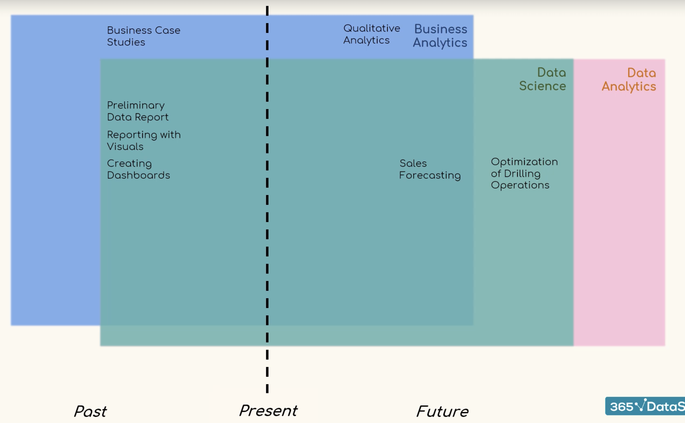

## Data Science: Analysis vs. Analytics

This video explores the key difference between **analysis** and **analytics** in the context of data science. 

**Analysis** focuses on **understanding past events**. It involves breaking down large datasets into smaller, manageable chunks to examine individual components and their relationships.  This process helps explain **how** and **why** something happened.

**Analytics**, on the other hand, uses insights gained from analysis to **predict future trends and outcomes**. It involves applying logical and computational reasoning to the data to identify patterns and explore potential future actions.

The video highlights two types of analytics:

* **Qualitative Analytics:** Uses intuition and experience, along with analysis, to make informed decisions. For example, an online clothing store owner might use qualitative analytics to decide which fashion trends to follow based on their knowledge of customer needs and wants. 
* **Quantitative Analytics:** Applies formulas and algorithms to numerical data from analysis. This can be used to predict optimal timing for introducing new products or services based on past sales data and user experience.

The video emphasizes that both analysis and analytics can be used together to gain a comprehensive understanding of data and make better decisions.  It also mentions that the terms "data analysis," "data analytics," "business analysis," and "business analytics" each have their own unique meanings, which will be explored in a future video. 

