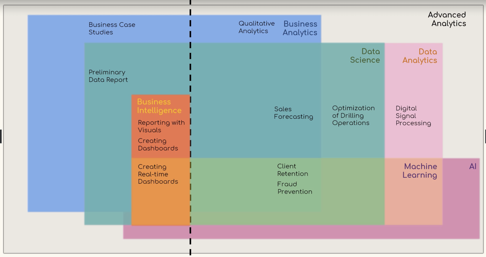

## Understanding Business Analytics, Data Analytics, and Data Science

This document aims to clarify the relationship between several key concepts in the field of data analysis. 

**Business Intelligence (BI)** focuses on analyzing historical data to understand past business performance and inform strategic decision-making. It relies heavily on reporting and dashboard creation to communicate insights. Think of BI as the first step towards predicting future trends.

**Data Analytics**, a broader field encompassing BI, uses data to answer questions, identify patterns, and generate insights. It forms the foundation for making informed decisions and predictions. 

**Machine Learning (ML)**, a subfield of data analytics, enables computers to learn from data and make predictions without explicit programming. ML algorithms analyze patterns within data to generate insights, recommendations, and predictions. 

**Data Science**, the most comprehensive of these terms,  encompasses data analytics and leverages various tools, techniques, and algorithms to extract knowledge and insights from data. Its applications extend to various business functions, including:

* **Real-time Dashboards:** Integrating machine learning with BI allows for dynamic, real-time dashboards that provide immediate insights and recommendations.
* **Client Retention and Acquisition:** Data science techniques, including ML, help predict customer behavior, enabling businesses to optimize their retention and acquisition strategies.
* **Fraud Prevention:** ML algorithms can analyze past fraudulent activities to identify patterns and flag suspicious transactions in real-time.

While often used interchangeably, **advanced analytics** is a subjective term implying a higher level of complexity. For clarity, consider all forms of analytics as potentially "advanced" based on their specific application and interpretation.

This overview provides a starting point for understanding the interconnectedness of these concepts. Keep in mind that interpretations may vary, and the field is continuously evolving. 

