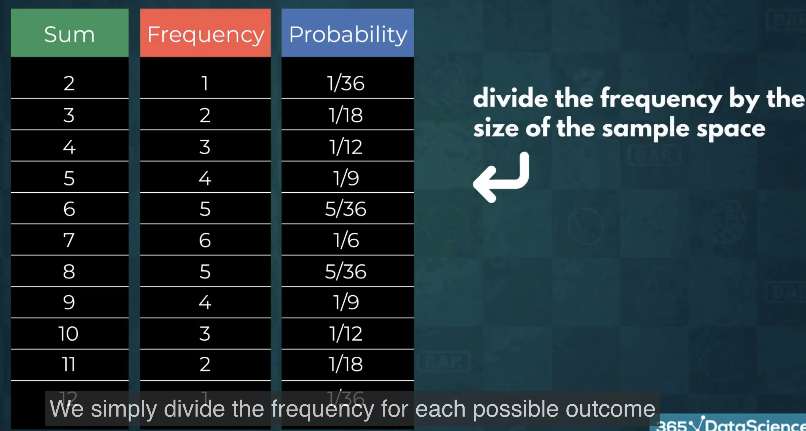

## Frequency Distribution: Understanding Data Probabilities

This video explores the concept of **frequency distribution** as a method for understanding the probability of different outcomes in data analysis. It uses the example of rolling two dice to illustrate the idea.

**Key Concepts:**

* **Expected Value:** This is a prediction of the average outcome of an event based on its probability distribution. It can be confusing when the probability of the expected value is low. For example, the expected value of rolling two dice is 7, but the probability of getting 7 is only 1/6.
* **Sample Space:** This refers to all possible outcomes of an event.  In the dice example, the sample space consists of 36 possible combinations (6 possibilities for the first die x 6 possibilities for the second die).
* **Frequency:** The frequency of an outcome represents how many times it occurs within the sample space. For example, a sum of 7 occurs 6 times in the dice sample space.
* **Probability Frequency Distribution:** This is a representation of the probabilities of each possible outcome. It can be displayed in a table or graph.
* **Probability:** The probability of an outcome is calculated by dividing its frequency by the total number of outcomes in the sample space.

**Example: Rolling Two Dice**

1. **Sample Space:**  All possible combinations of rolling two dice (36 total).
2. **Frequency:**  Each possible sum (2 to 12) appears a certain number of times. For example, the sum of 7 appears 6 times.
3. **Probability:** The probability of getting a sum of 7 is 6/36 (frequency of 7 divided by total outcomes).
4. **Probability Frequency Distribution:** This could be represented in a table or graph showing the probability of each possible sum.

**Importance of Frequency Distribution:**

* **Understanding Probabilities:** Provides a visual representation of the likelihood of different outcomes.
* **Making Predictions:** Helps to identify the most likely outcomes, allowing us to make more informed predictions.
* **Identifying Trends:**  Allows us to see how frequencies change across the range of outcomes.

**Limitations of Expected Value:**

While the expected value provides a central tendency for the data, it doesn't tell us the likelihood of getting that value.  Frequency distribution offers a more complete picture by showing the probabilities of all possible outcomes.

**Complement of an Event:**

The complement of an event refers to all possible outcomes that are *not* in the event. This concept is crucial for understanding probabilities and will be explained in more detail in the next lecture.

**Key Takeaway:**

Frequency distribution provides a valuable tool for analyzing data and understanding the probabilities of different outcomes. It complements the use of expected value and offers a more comprehensive view of the data distribution.
