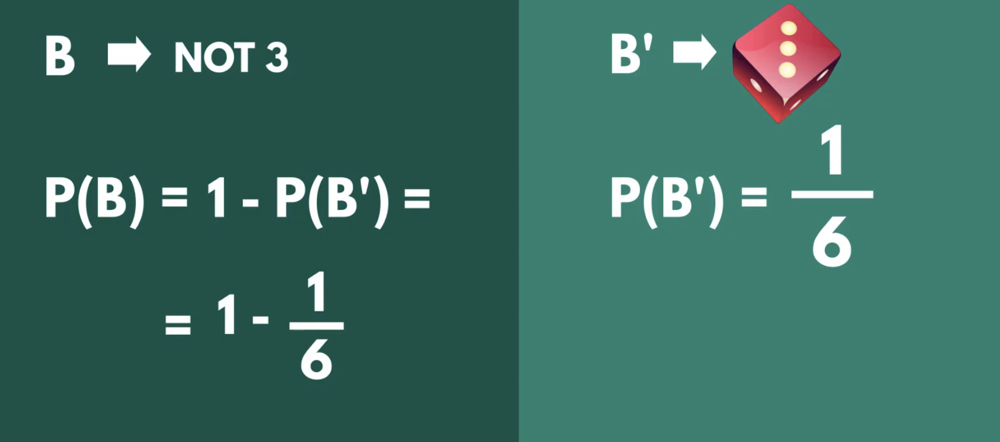

## Document Summary: Events and Their Complements

This video introduces the concept of complements in probability theory. The instructor explains that the complement of an event encompasses all the possible outcomes that are not part of the original event. 

**Key Concepts:**

* **Complement of an Event:** The complement of an event A, denoted as A', includes all outcomes in the sample space that are not in A.
* **Sum of Probabilities:** The sum of probabilities of all possible outcomes in a sample space is always equal to 1, representing 100% certainty. 
* **Calculating Complements:** The probability of the complement of an event (A') is calculated as 1 minus the probability of the event itself (P(A')): P(A') = 1 - P(A).

**Examples:**

* **Coin Toss:** When tossing a coin, the possible outcomes are heads (H) or tails (T). The complement of getting heads (H') is getting tails (T), and vice versa. Since these are the only possibilities, the sum of their probabilities is 1 (P(H) + P(T) = 1). 
* **Rolling a Die:**  Consider rolling a standard six-sided die. The event of rolling an even number (2, 4, or 6) has a complement of rolling an odd number (1, 3, or 5). The probability of rolling an even number (P(even)) is 1/2, while the probability of rolling an odd number (P(odd)) is also 1/2, making the sum of probabilities equal to 1.

**Applying the Concept:**

* **Finding the Probability of Not Getting a Specific Outcome:** If you want to find the probability of not rolling a 3 on a die, you can use the complement. The probability of rolling a 3 (P(3)) is 1/6. Therefore, the probability of not rolling a 3 (P(not 3)) is 1 - 1/6 = 5/6. 
* 

**Importance:**

Understanding complements is crucial in probability as it allows you to calculate the likelihood of events that are defined as the "opposite" of a given event. This concept is particularly useful when dealing with scenarios with numerous possible outcomes. 

**Next Steps:**

The video concludes by transitioning into the next section of the course, which focuses on combinatorics and introduces concepts like variations, permutations, and combinations. 
