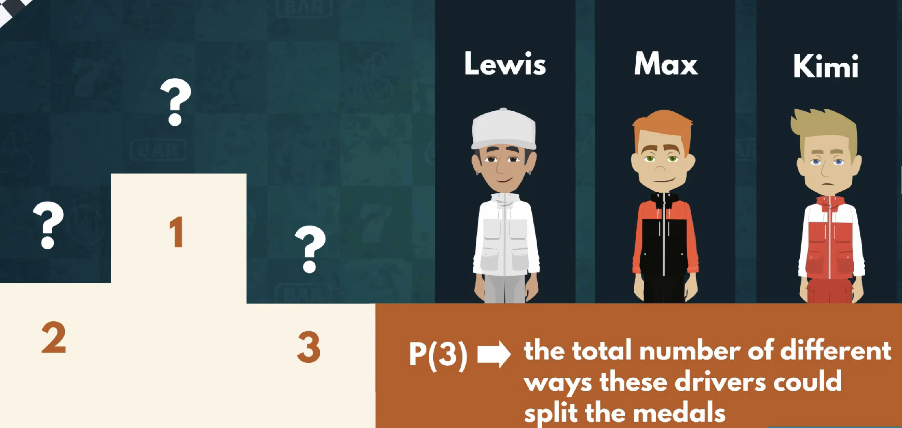
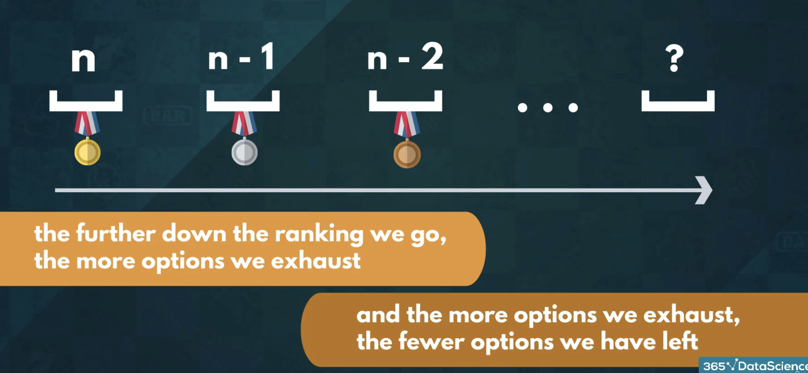

## Document Summary: Permutations and How to Use Them

This video introduces the concept of permutations in combinatorics, focusing on how to calculate the number of possible arrangements for a set of elements. 

**Key Concepts:**

* **Permutation:** A permutation represents a specific arrangement of objects in a set. It emphasizes the order of the elements. 
* **Number of Permutations (nPr):** The number of permutations of *r* elements chosen from a set of *n* elements is denoted as *nPr*. It represents the total number of distinct ways to arrange *r* elements out of *n*.
* **Factorial (n!):** The factorial of a non-negative integer *n*, denoted as *n*!, represents the product of all positive integers less than or equal to *n*. It is used in calculating the number of permutations. 

**Example:**

* **Formula One Podium:** The video uses the example of three Formula One drivers (Lewis, Max, and Kimi) on the podium. Each possible order they could finish represents a permutation. There are 6 possible permutations for 3 drivers:
    * Lewis-Max-Kimi
    * Lewis-Kimi-Max
    * Max-Lewis-Kimi
    * Max-Kimi-Lewis
    * Kimi-Lewis-Max
    * Kimi-Max-Lewis

**Intuition behind Calculating Permutations:**

* **Filling Positions:** Imagine filling positions one by one. For the first position (winner), you have *n* choices. For the second position, you have *n-1* choices left, and so on. This continues until you reach the last position, where you have only one option left. 
* **Mathematical Representation:** The total number of permutations is the product of the number of choices for each position: *n*(n-1)*(n-2)*...*1*. This is represented as *n*! (n factorial).

**Important Note:**

* When calculating the number of permutations, it is assumed that all elements in the set are distinct.
* The order of the elements matters. Swapping the positions of two elements creates a new permutation.

**Next Steps:**

The video concludes by hinting at the properties of factorials and their relation to permutations, promising to discuss them in the next video. 
